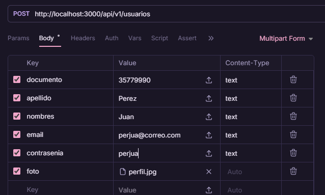

# GrupoAB_TFI

# Programacion 3 Trabajo Final Integrador 

## Información del Grupo
- **Materia**: Programacion 3
- **Carrera**: Tecnicatura Universitaria en Desarrollo Web
- **Institución**: Facultad de Ciencias de la Administración - UNER
- **Cuatrimestre**: 2026 - 1er Cuatrimestre
- **Grupo**: AB

## Integrantes
| Apellido y Nombre           |
|-----------------------------|
| Blanc, Eugenia              |
| Larran, Jorge Eduardo       |
| Sanchez, Damiana Agustina   |
| Santana, Micaela            |
| Valdez, Alvaro Miguel       |

## Descripción del Proyecto
Este proyecto es una API REST para la gestión de turnos, médicos y especialidades de una clínica, desarrollada como parte del Trabajo Final Integrador de Programación 3. La arquitectura sigue un patrón de cuatro capas para garantizar la escalabilidad, mantenibilidad y separación de responsabilidades.

## Tecnologías Utilizadas
- Node.js y Express para el servidor.
- MySQL con el driver mysql2/promise para la persistencia.
- Express-Validator para la validación de datos de entrada.

**NUEVO** 
- Transacciones y Procedimientos Almacenados en MySQL
- JWT, Passport.js (Local/JWT) y CORS para la seguridad.
- Swagger para la documentación.
- Morgan para los registros de accesos.
- Multer para la carga de archivos (imagenes).
- PDFkit para la generacion dinamica de reportes estadisticos en PDF.

## Arquitectura del Proyecto
1. Routes: Define los endpoints siguiendo el estándar REST.
2. Middlewares: Actúa como un filtro de seguridad que intercepta la petición.
3. Controllers: Gestiona las solicitudes HTTP, delega la lógica al servicio y retorna códigos de estado estándar.
4. Services: Contiene la lógica de negocio y coordina la comunicación entre el controlador y la base de datos.
5. Database: Realiza las consultas SQL directas utilizando un pool de conexiones para optimizar recursos.

## Objetivos Cumplidos
[x] BREAD completo de todas las entidades.

[x] Arquitectura en capas.

[x] Versionado del API Rest.

[x] Nombres correctos en rutas.

[x] Uso de códigos de estados HTTP estándar.

[x] Respuestas consistentes.

**NUEVO**

[x] Autenticación JWT y Autorización por roles.

[x] Procedimientos Almacenados.

[x] API documentada con Swagger.

[x] Implementación de carga de archivos.

[x] Generación de informes en PDF.

## Guía de Pruebas (Bruno)
Para probar la carga de imágenes siga los siguientes pasos en Bruno:

1. **Método**: `POST` a `/api/v1/usuarios`.
2. **Body**: Seleccionar **Multipart Form**.
3. **Campos**:
- `documento`, `apellido`, `nombres`, `email`, `contrasenia` (Tipo: `text`).
- `foto` (Tipo: `auto`, cargar imagen).

Última actualización: 13/06/2026